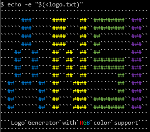

## Overview

Create ANSI art/logos by drawing them in Microsoft Excel. This would make for a fun addition to your cli projects, or a splash screen for a program (provided you know the user's terminal supports truecolor, more on that below).

## Requirements

Microsoft Excel with macros enabled. This was created using a 2019 version of Excel on Windows, but is likely to work with much older versions as well.

## Code

To view the code press `Alt` and `F11` to open the VBA editor

## Usage


1. Ensure macros are enabled
1. Click `Clear All Cells` to clear the workspace
1. Enter the character you would like for an empty non-highlighted cell next to "Blank Char", cell `BG1`
1. Enter the character you would like for an empty highlighted cell next to "Fill Char", cell `AZ1`
1. Draw your logo/spash screen by highlighting cells and typing characters
   * Enter a character into a cell where you would like it to appear. It is recommeneded that each cell contains at most 1 character
   * Highlight cells the color you would like the character in that position to be
6. Set the width and height of the drawing in cells `AL1` and `AS1`
1. Click `Generate Screen` to generate the logo with included ANSI escape characters
1. Click `Copy to clipboard` to copy the generated logo

Cell is highlighted  | Cell has value  | Character and Color Produced
------------------|-------------|-----------------------
No | No | "Blank Char" with default color
No | Yes | Cell value with default color
Yes | No | "Fill Char" with cell highlight color
Yes | Yes | Cell value with cell highlight color

The above drawing produces the following result. Note that the backtick character `` ` `` has been input into "Blank Char" which gives the following 'background'. Using a space instead would give a cleaner looking background if preferred. The cells containing the letters `R`, `G` and `B` are colored to make these characters the corresponding color when printed.




## Compatability

This program makes use of 24-bit color ANSI codes to change the output color, which are of the following form

```
\e[38;2;R;G;Bm
```

where `\e` is the escape character and `R`, `G` and `B` are the RGB values from 0 to 255.  

Not all terminals support this format, though many do. [Here](https://gist.github.com/XVilka/8346728) is a list of terminals that do and do not support true color, including how to detect whether the terminal being outputted to supports it.

## Why Excel

The spreadsheet in excel make for a convenient GUI for 'drawing' logos one character at a time, which can then be processed with VBA commands to produce the ANSI sequence.

## Known Issues

Placing `\` in certain positions in the drawing may cause double backslashes to appear in the output, ie `\\e[38;2;R;G;Bm` which can lead to undesired behaviour such as the actual escape sequence appearing when outputting to a terminal.
